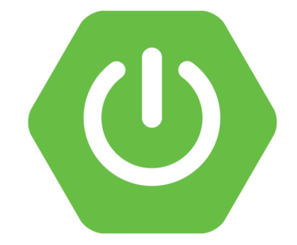

  <h1 align="center"><b>Here is Ali </b></h1>

My name is Ali and I'm Infromatic Engineer graduated from [Siegen University](https://www.uni-siegen.de/start/), Siegen Germany.
Currently i am working as Software Developer in [ROLAND Rechtsschutz-Versicherungs-AG](https://www.roland-rechtsschutz.de/), Köln - Germany.

Here are some infos to get some ideas about me :

- 🔭 I’m working as Software Developer at [ROLAND Rechtsschutz-Versicherungs](https://www.roland-rechtsschutz.de/), Köln 🇩🇪
- 🤓 I'm Java programmer and web developer
- 🥅 2024 Goals: Contribute to Open Source projects
- 💬 Ask me about anything you want 😊
- 😄 Pronouns: he / his
- ⚡ Fun fact: I speak 4 languages English 🇺🇸 , German 🇩🇪 , Turkish 🇹🇷 and Arabic 🇸🇾
- 🏡 Originally from **Aleppo** 🇸🇾, living in **Siegen** 🇩🇪

<!--
### ✈️ Visited Countries : 🇲🇹 🇹🇷 🇩🇪 🇦🇹 🇪🇸 🇱🇧 🇨🇭 🇮🇹 🇫🇷 🇳🇱 🇮🇪 🇨🇿 🇸🇾 
-->

### ⚙️ Languages and Tools:
<!-- start tools and languages -->
<!--

-->

<!-- start tools and languages -->
 
 

### 🌍 Languages :

| Language      | Proficiency                                                               | Certificate                                                 |
| ------------- | ------------------------------------------------------------------------- | ------------------------------------------------------------|
| 🇺🇸 English    | Upper Intermediate                                                        |-                                                            |
| 🇩🇪 German     | C1                                                                        |[DSH 2](https://www.dsh-germany.com)                         |
| 🇹🇷 Turkish    | C2                                                                        |[Tömer](https://tr.wikipedia.org/wiki/Türkçe_Yeterlik_Sınavı)|
| 🇸🇾 Arabic     | Native Language                                                           |-                                                            |

 

### 💻 Project has been done in 2021 :

         

### 📈 My GitHub Stats :

        

### 📬 Find me on :
 
 
 
 
 
 
 
  

